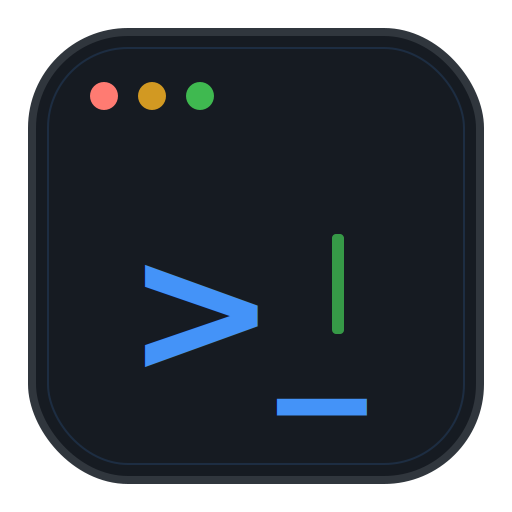

<div align="center">



# DevCommandCenter

**A modern desktop app for managing and running your development commands.**

[](https://www.python.org/)
[](https://doc.qt.io/qtforpython/)
[](https://sqlite.org/)
[](LICENSE)

</div>

---

## Overview

DevCommandCenter is a sleek, developer-focused desktop application that lets you **save, organize, run, and monitor** all your frequent development commands from a single, beautiful interface. No more scattered terminal windows or forgotten npm scripts.

Built with a dark, accessible UI inspired by GitHub's design system, it offers a card-based layout, real-time process monitoring, and persistent execution logs.

---

## Features

### Command Management
- **Card-based layout** — Visual grid of all your commands with status indicators.
- **CRUD operations** — Create, edit, delete, and duplicate commands easily.
- **Tagging system** — Organize commands with custom tags for quick filtering.
- **Auto-run** — Mark commands to run automatically when the app starts.
- **Import/Export** — Share your command configurations as JSON files.

### Process Execution
- **Parallel execution** — Run multiple commands simultaneously without blocking.
- **Safe stop** — Gracefully terminate processes with automatic force-kill after 3 seconds.
- **Status tracking** — Real-time status: `Running`, `Stopped`, or `Failed`.
- **Sidebar filters** — Quickly filter commands by status (All / Running / Stopped / Failed).

### Logging & History
- **Real-time logs** — Live stdout/stderr streaming per command in dedicated windows.
- **Persistent history** — Every execution is saved to SQLite with output, errors, exit code, and timestamps.
- **Review past runs** — Reopen log windows to see the result of the last execution.
- **Clear timestamps** — All log entries include precise timestamps.

### UI/UX
- **Dark theme** — Accessible WCAG AA compliant color palette (GitHub Dark inspired).
- **Responsive grid** — Cards reflow dynamically based on window width.
- **Fixed-size cards** — Consistent 320x300px cards for a polished look.
- **High contrast** — Solid color buttons with white text for excellent readability.
- **Custom app icon** — SVG logo rendered for all window sizes and taskbar.

---

## Tech Stack

| Technology | Purpose |
|---|---|
| **Python 3.12+** | Core language with modern type hints |
| **PySide6 (Qt6)** | Native desktop UI framework |
| **SQLAlchemy 2.0** | ORM for database operations |
| **SQLite** | Local persistent storage |
| **QProcess** | Safe cross-platform process management |

---

## Getting Started

### Prerequisites

- Python 3.12 or higher
- pip (Python package manager)

### Installation

```bash
# Clone the repository
git clone https://github.com/MathiasPaulenko/dev-command-center.git
cd dev-command-center

# Create virtual environment (recommended)
python -m venv .venv
.venv\Scripts\activate  # Windows
# source .venv/bin/activate  # Linux/macOS

# Install dependencies
pip install -r requirements.txt
```

### Running the App

```bash
python main.py
```

The app will automatically initialize the database and seed demo commands on first run.

---

## Usage

1. **Add a command** — Click "+ New Command" in the sidebar and fill in the details.
2. **Run it** — Click the green **Run** button on any card.
3. **Monitor** — Click **Logs** to see real-time output in a dedicated window.
4. **Filter** — Use the sidebar buttons to show only Running, Stopped, or Failed commands.
5. **Search** — Use the search box to find commands by name, description, or tag.

---

## Testing

```bash
python tests/test_mvp.py
```

This runs a minimal validation suite that creates a test command and verifies persistence.

---

## Project Structure

```text
dev-command-center/
├── assets/
│   └── logo.svg                    # Application icon (SVG)
├── devcommandcenter/
│   ├── config.py                   # App constants (name, version, DB URL)
│   ├── database/
│   │   ├── connection.py           # SessionLocal, init_db, engine
│   │   └── models.py               # SQLAlchemy ORM models
│   ├── services/
│   │   ├── command_service.py      # Command CRUD operations
│   │   ├── execution_log_service.py # Execution log persistence
│   │   └── process_service.py      # QProcess lifecycle management
│   ├── ui/
│   │   ├── theme.py                # Color palette & stylesheets
│   │   ├── main_window.py          # Main window & CommandCard widget
│   │   ├── log_window.py           # Real-time log viewer (non-modal)
│   │   └── command_dialog.py       # Create/Edit command modal
│   └── utils/
│       └── ...                     # Shared helpers
├── tests/
│   └── test_mvp.py                 # Minimum validation suite
├── main.py                         # Application entry point
├── requirements.txt                # Python dependencies
├── AGENTS.md                       # Project rules & standards
└── LICENSE                         # MIT License
```

---

## Architecture

```
┌─────────────────────────────────────────┐
│              UI Layer                   │
│  ┌──────────┐  ┌──────────┐  ┌────────┐ │
│  │MainWindow│  │LogWindow │  │Command │ │
│  │(Cards)   │  │(Logs)    │  │Dialog  │ │
│  └────┬─────┘  └────┬─────┘  └───┬────┘ │
└───────┼─────────────┼────────────┼──────┘
        │ Signals     │            │
┌───────┼─────────────┼────────────┼──────┐
│       ▼             ▼            ▼       │
│  ┌─────────────────────────────────────┐ │
│  │         ProcessService                │ │
│  │  (ManagedProcess per command_id)    │ │
│  └──────────────────┬──────────────────┘ │
│                     │ QProcess           │
│  ┌──────────────────┴──────────────────┐ │
│  │         Service Layer               │ │
│  │  CommandService │ ExecutionLogSvc  │ │
│  └──────────────────┬──────────────────┘ │
│                     │ SQLAlchemy         │
│  ┌──────────────────┴──────────────────┐ │
│  │         Data Layer                  │ │
│  │            SQLite                   │ │
│  └─────────────────────────────────────┘ │
└──────────────────────────────────────────┘
```

---

## Contributing

Contributions are welcome! Please read [AGENTS.md](AGENTS.md) for the project's coding standards and UI/UX guidelines before submitting changes.

1. Fork the repository
2. Create a feature branch (`git checkout -b feat/amazing-feature`)
3. Commit your changes (`git commit -m 'feat: add amazing feature'`)
4. Push to the branch (`git push origin feat/amazing-feature`)
5. Open a Pull Request

---

## License

This project is licensed under the **MIT License** — see the [LICENSE](LICENSE) file for details.

---

## Acknowledgments

- Built with [Qt for Python (PySide6)](https://doc.qt.io/qtforpython/)
- Dark theme inspired by [GitHub's Primer design system](https://primer.style/)
- Logo designed with accessibility and clarity in mind

---

<div align="center">

**Developed by [Mathias Paulenko Echeverz](https://github.com/MathiasPaulenko)**

</div>
